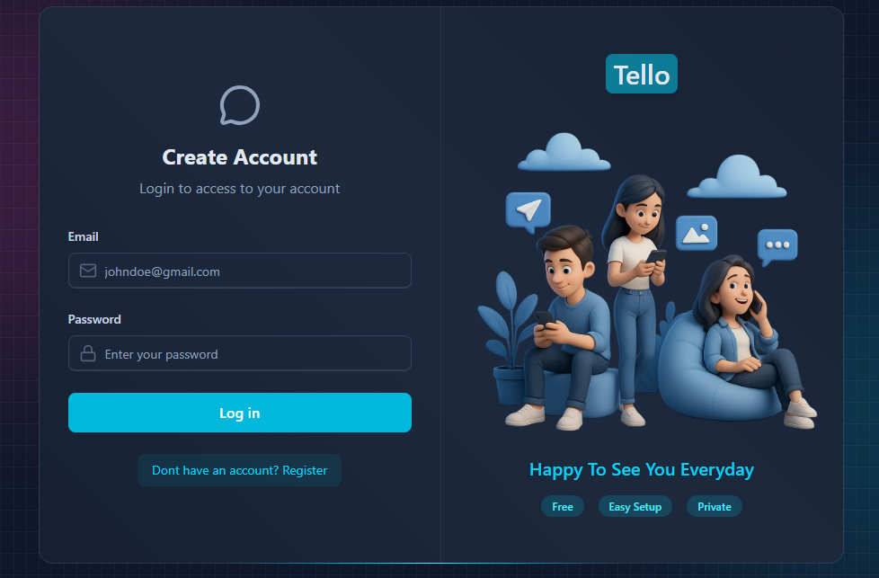
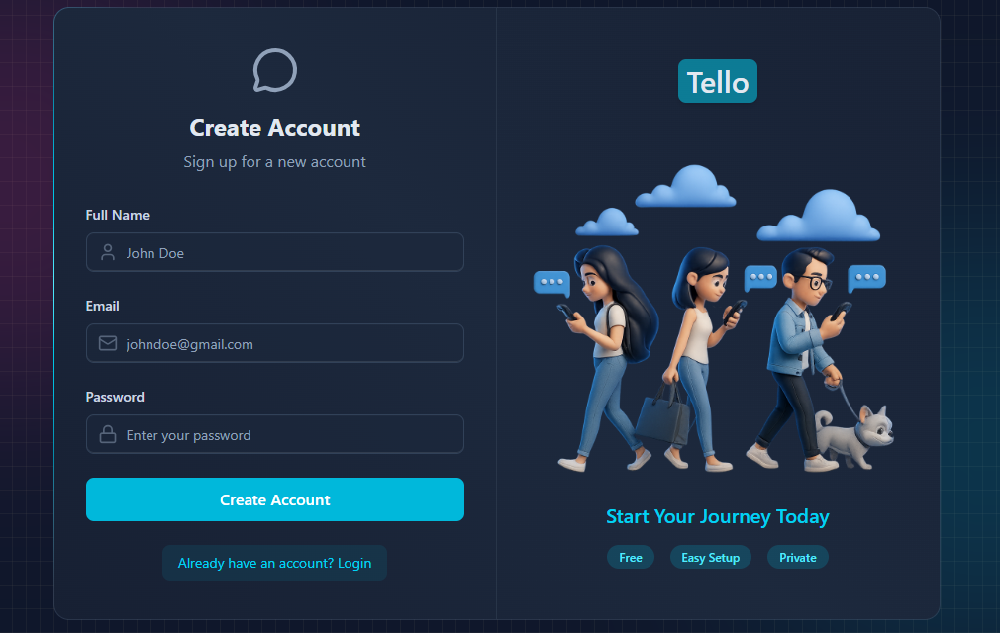

# 🚀 Tello – MERN Stack Chat Application

Tello is a **full-stack MERN chat application** built with modern web technologies.  
The project focuses on **clean architecture, secure authentication, real-time messaging, and scalable backend design**.

---

## 🧩 Tech Stack

### Frontend

- **React (Vite)**
- **Tailwind CSS** – UI styling
- **Zustand** – State management
- **Axios** – API communication
- **React Router** – Routing
- **Framer Motion** – Animations

### Backend

- **Node.js**
- **Express.js**
- **MongoDB + Mongoose**
- **JWT Authentication** (HttpOnly Cookies)
- **Socket.IO** – Real-time communication
- **Cloudinary** – Image upload & storage
- **Resend** – Email service
- **Arcjet** – Security & rate limiting

### Database

- **MongoDB Atlas**

---

## ✨ Features

- 🔐 Secure authentication (JWT + HttpOnly Cookies)
- 👤 User registration & login
- 💬 Real-time chat using Socket.IO
- 🖼 Upload profile images with Cloudinary
- 📧 Email notifications (verification / onboarding)
- 🛡 Rate limiting & security with Arcjet
- 📱 Responsive UI (mobile-friendly)
- ⚡ Optimized API & state management

---

## 📂 Project Structure

```
Tello/
├── Backend/              # Backend (Express)
│   ├── controllers/
│   ├── models/
│   ├── routes/
│   ├── middlewares/
│   ├── server.js
│
├── Frontend/             # Frontend (React + Vite)
│   ├── src/
│   ├── public/
│   ├── package.json
│   └── vite.config.js
│
├── .gitignore
└── README.md

```

---

## 🛠 Installation & Setup (Local Development)

### 1️⃣ Clone the repository

```bash
git clone https://github.com/your-username/tello.git
cd tello
```

### 2️⃣ Backend setup

```bash
cd Backend
npm install
npm run dev

```

### 3️⃣ Frontend setup

```bash
cd Frontend
npm install
npm run dev
```

Frontend will run on:

```
http://localhost:5173
```

---

### Deployment

- Frontend: Vercel
- Backend: Node.js Server
- Database: MongoDB Atlas

```bash
cd Frontend && npm run build
```

5. Output Directory:

```
Frontend/dist
```

6. Deploy 🎉

---

## 📸 Screenshots

>  > 

---

## 🧠 What I Learned

- Building scalable MERN applications
- Secure authentication using JWT & cookies
- Deploying full‑stack apps on Vercel
- Structuring real‑world projects
- Handling production‑ready environment variables

---

## ⭐ Support

If you like this project, please give it a **star ⭐** on GitHub — it really helps!
